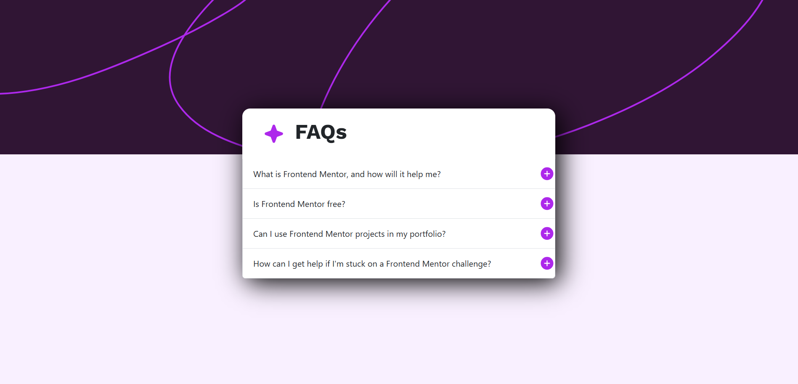
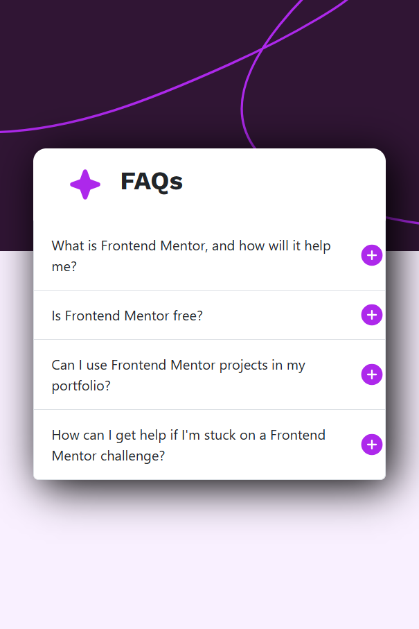

# Frontend Mentor - FAQ accordion solution

This is a solution to the [FAQ accordion challenge on Frontend Mentor](https://www.frontendmentor.io/challenges/faq-accordion-wyfFdeBwBz).  

## Table of contents

  - [The challenge](#the-challenge)
  - [Screenshot](#screenshot)
  - [Built with](#built-with)
  - [What I learned](#what-i-learned)
- [Author](#author)

### The challenge

Users should be able to:

- Hide/Show the answer to a question when the question is clicked.
- View the optimal layout for the interface depending on their device's screen size.
- See hover and focus states for all interactive elements on the page.

### Screenshot

- Desktop view:

-Mobile view:

- Hover view:

### Built with

- Bootstrap 5
- CSS custom properties
- Javascript
- Flexbox
- Media Query

### What I learned
  I learned: 

- using of javascript I learned how hide/show the plus/minus icons.
- how to select elements using javascript.
- use of bootstrap.

## Author

- Frontend Mentor (see my other challenges) - (https://www.frontendmentor.io/profile/Ajinkya9834)
- My Linkedin profile - (www.linkedin.com/in/ajinkya-hajare)